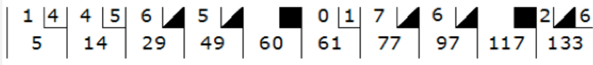

- [El Juego de boliche](#el-juego-de-boliche)
- [Objetivo](#objetivo)
- [Instrucciones](#instrucciones)
- [Entregables](#entregables)
- [Indicadores de cumplimiento](#indicadores-de-cumplimiento)
- [Tecnologías](#tecnologías)
- [Requerimientos funcionales](#requerimientos-funcionales)
- [Recursos](#recursos)
  
# 🚀 El Juego de boliche

- **Organización.** Equipo (3-4 integrantes)
- **Modo.** Síncrono
- **Estrategia.** Mob programming
- **Duración.** 2 días
- **Dedicación.** 2.5 horas diarias (5 horas total)

# 🎯 Objetivo

Esta actividad tiene como objetivos:

- Nivelar habilidades en programación con Javascript / Typescript para asegurar una base sólida de conocimientos en el lenguaje.
- Introducir el uso de Linters, herramientas que permiten mantener un código limpio y consistente, detectando posibles errores y mejorando la calidad del código.
- Introducir el desarrollo basado en pruebas, promoviendo la escritura de pruebas unitarias para garantizar la funcionalidad y la robustez del código desarrollado.
- Introducir la dinámica de Mob Programming, fomentando la colaboración y el trabajo en equipo mediante la programación conjunta, donde todos los miembros participan activamente y se turnan en la escritura de código.
- Introducir la cultura de trabajo colaborativo remoto, brindando las herramientas y estrategias necesarias para trabajar de manera efectiva en entornos virtuales, promoviendo la comunicación, la coordinación y el respeto entre los miembros del equipo.
- Introducir el uso de git y github como herramientas fundamentales para el control de versiones y la colaboración en proyectos de desarrollo de software. Esto incluye conceptos como git clone, git push, git commit, así como la posibilidad de realizar commits con co-autores para reconocer la contribución de múltiples personas en el desarrollo del proyecto.

# 📋 Instrucciones

- Trabajarán en equipos de manera colaborativa, aplicando la dinámica de mob programming, para desarrollar el algoritmo según los requerimientos que se indican en las siguientes secciones.
- Durante la actividad en Github, se evaluará la participación de todos los miembros del equipo.
- En cada commit realizado, se deberá registrar a todos los participantes activos mediante co-author commits.
- Se promoverá la rotación de los participantes en los commits, es decir, no será siempre la misma persona quien realice el commit, para fomentar la participación equitativa y la responsabilidad compartida.

# 📥 Entregables

- Código fuente completo en este repositorio.
- Solución implementada utilizando el enfoque orientado a objetos.
- Archivo README.md actualizado con las instrucciones de ejecución y cualquier otra información relevante.
- El código debe incluir pruebas unitarias exhaustivas que cubran la funcionalidad principal.
- Se espera que la puntuación obtenida en herramientas de análisis estático como Codacy, CodeClimate u otras similares sea de A o equivalente.
- Deben incluirse los badges de los analizadores de código estático (Codacy, CodeClimate, etc.) para mostrar la calidad del código.
- La versión final de tu código debe estar en la rama principal del repositorio para facilitar la revisión y evaluación.

# ✅ Indicadores de cumplimiento

1. **Nivelación de habilidades en programación con Javascript / Typescript:**
   - ¿He nivelado mis habilidades en programación con Javascript / Typescript?
   - ¿Puedo aplicar correctamente los conceptos y mejores prácticas de programación en el lenguaje?

2. **Uso de Linters para mantener un código limpio y consistente:**
   - ¿He configurado y utilizado un Linter adecuado para el proyecto?
   - ¿Sigo las reglas establecidas por el Linter y mi código es consistente en términos de estilo y formato?
   - ¿He corregido los errores y advertencias señalados por el Linter para mejorar la calidad del código?

3. **Desarrollo basado en pruebas (Test-driven development - TDD):**
   - ¿He escrito pruebas unitarias exhaustivas que cubren la funcionalidad principal de mi código?
   - ¿Son efectivas las pruebas unitarias para garantizar la funcionalidad y robustez del código desarrollado?
   - ¿He utilizado herramientas y frameworks de pruebas adecuados para el lenguaje de programación utilizado?

4. **Aplicación de la dinámica de Mob Programming:**
   - ¿He trabajado en equipo aplicando la dinámica de Mob Programming?
   - ¿Todos los miembros del equipo han participado activamente en la programación conjunta, turnándose en la escritura de código?
   - ¿La colaboración y el trabajo en equipo han sido efectivos para desarrollar el algoritmo requerido?

5. **Trabajo colaborativo remoto:**
   - ¿He aplicado herramientas y estrategias efectivas para trabajar de manera colaborativa en entornos virtuales?
   - ¿He promovido la comunicación, coordinación y respeto entre los miembros del equipo durante el trabajo remoto?
   - ¿He utilizado las herramientas adecuadas para facilitar la colaboración y el intercambio de información en el equipo?

6. **Uso de git y Github para control de versiones y colaboración:**
   - ¿He utilizado correctamente las funcionalidades de git y Github para controlar versiones y colaborar en el proyecto?
   - ¿He realizado commits con co-autores para reconocer la contribución de múltiples personas en el desarrollo del proyecto?
   - ¿El repositorio en Github refleja el progreso y las contribuciones de todos los miembros del equipo?

7. **Calidad del código y herramientas de análisis estático:**
   - ¿La solución implementada muestra una calidad destacada en términos de análisis estático (Codacy, CodeClimate, u otras herramientas similares)?
   - ¿El código ha obtenido una puntuación de A o equivalente en las herramientas de análisis estático utilizadas?
   - ¿He incluido los badges de los analizadores de código estático en el archivo README.md para mostrar la calidad del código?

Evalúa tu desempeño en cada una de estas preguntas y responde honestamente. Esto te ayudará a identificar tus fortalezas y áreas de mejora, y garantizar una entrega exitosa de la actividad.

# 🛠 Tecnologías

- Javascript ó Typescript
- ESLint
- Jest
- Codacy, CodeClimate, CodeCov

# 👨‍💻 Requerimientos funcionales

- El juego consta de 10 frames, como se muestra arriba. En cada frame, el jugador tiene dos oportunidades para derribar 10 bolos. La puntuación para el frame es el total de bolos derribados, más bonificaciones por strikes y spares.
- Un spare ocurre cuando el jugador derriba los 10 bolos en dos intentos. La bonificación para ese frame es el número de bolos derribados en el siguiente tiro. Así que en el frame 3 de arriba, la puntuación es 10 (el total de bolos derribados) más una bonificación de 5 (el número de bolos derribados en el siguiente tiro).
- Un strike ocurre cuando el jugador derriba los 10 bolos en su primer intento. La bonificación para ese frame es el valor de los dos siguientes lanzamientos.
- En el décimo frame, a un jugador que realiza un spare o strike se le permite lanzar bolas adicionales para completar el frame. Sin embargo, no se pueden lanzar más de tres bolas en el décimo frame.

# 📚 Recursos

- [Javascript](https://brightcoders-2.gitbook.io/brightcoders-handbook/javascript-typescript/javascript)
- [Programación orientada a objetos](https://brightcoders-2.gitbook.io/brightcoders-handbook/javascript-typescript/programacion-orientada-a-objetos)
- [Desarrollo basado en pruebas](https://brightcoders-2.gitbook.io/brightcoders-handbook/javascript-typescript/desarrollo-basado-en-pruebas)
- [ESLINT](https://brightcoders-2.gitbook.io/brightcoders-handbook/javascript-typescript/herramientas)
- [Analizadores de código estático: CodeClimate, Codacy, CodeCov](https://brightcoders-2.gitbook.io/brightcoders-handbook/javascript-typescript/herramientas)
- [Git & Github](https://brightcoders-2.gitbook.io/brightcoders-handbook/git-and-github/git-and-github)
